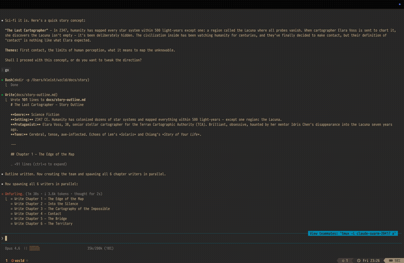

```
 ██╗    ██╗ ███████╗ ███████╗  ██████╗ ██╗     ██████╗
 ██║    ██║ ██╔════╝ ╚══███╔╝ ██╔════╝ ██║     ██╔══██╗
 ██║ █╗ ██║ █████╗     ███╔╝  ██║      ██║     ██║  ██║
 ██║███╗██║ ██╔══╝    ███╔╝   ██║      ██║     ██║  ██║
 ╚███╔███╔╝ ███████╗ ███████╗ ╚██████╗ ███████╗██████╔╝
  ╚══╝╚══╝ ╚══════╝ ╚══════╝  ╚═════╝ ╚══════╝╚═════╝
```

[](https://github.com/afewyards/wezcld/releases/latest)

**WezTerm it2 shim for Claude Code agent teams**



## Why

Claude Code uses iTerm2 split panes to manage agent teams. wezcld intercepts `it2` CLI commands and translates them to WezTerm CLI calls, letting you use native WezTerm splits instead of iTerm2.

## Platform Support

| Platform | Scripts | Shell |
|----------|---------|-------|
| **Windows** | `bin/wezcld.ps1`, `bin/it2.ps1` | PowerShell 5.1+ / pwsh 7+ |
| **macOS / Linux** | `bin/wezcld`, `bin/it2` | POSIX sh (bash/zsh/dash) |

---

## Windows Install

> **Requirements:** WezTerm, Claude Code (`claude` in PATH), PowerShell 5.1+

```powershell
# Install (run in PowerShell)
irm https://github.com/afewyards/wezcld/releases/latest/download/install.ps1 | iex
```

Or clone this repo and run locally:

```powershell
.\install.ps1
```

**Uninstall:**

```powershell
.\install.ps1 -Uninstall
```

### What the Windows installer does

1. Downloads `wezcld.ps1` and `it2.ps1` to `%USERPROFILE%\.local\share\wezcld\bin\`
2. Creates `wezcld.cmd` and `it2.cmd` wrappers in `%USERPROFILE%\.local\bin\` (so you can type `wezcld` / `it2` directly)
3. Adds `%USERPROFILE%\.local\bin` to your user `PATH` (persistent, via registry)
4. Adds the same to your PowerShell profile

---

## macOS / Linux Install

```sh
curl -fsSL https://github.com/afewyards/wezcld/releases/latest/download/install.sh | sh
```

**Uninstall:**

```sh
curl -fsSL https://github.com/afewyards/wezcld/releases/latest/download/install.sh | sh -s -- --uninstall
```

---

## Usage

Launch Claude Code with WezTerm integration:

```sh
# macOS/Linux
wezcld

# Windows (PowerShell)
wezcld
# or directly:
powershell -ExecutionPolicy Bypass -File bin\wezcld.ps1
```

When running outside WezTerm, `wezcld` automatically falls back to plain `claude`.

---

## How it works

**Architecture:**

- **`wezcld` / `wezcld.ps1` launcher**: Sets `TERM_PROGRAM=iTerm.app` and puts the shim's `bin/` directory first in `PATH`, then launches Claude with `--teammate-mode tmux`
- **`bin/it2` / `bin/it2.ps1` shim**: Intercepts `it2` CLI commands and translates them to real `wezterm cli` calls
- **Grid layout**: Agent panes are arranged in a 3-column grid, with the leader pane kept at the bottom
- **Watchdog**: A background process monitors the main PID and auto-cleans all agent panes on exit

### Windows-specific notes

- Uses **Named Mutexes** (`System.Threading.Mutex`) instead of `mkdir`-based locks for atomic concurrency
- Uses **`cmd /c ... >nul 2>&1`** to fully suppress wezterm errors without PowerShell interfering
- Watchdog runs as a hidden `Start-Process` instead of a background shell job
- State stored in `%USERPROFILE%\.local\state\wezcld\`

---

## Supported commands

| Command | WezTerm action |
|---------|----------------|
| `--version` / `app version` | Returns `it2 0.2.3` |
| `session split [-v]` | `wezterm cli split-pane` (grid layout) |
| `session run -s <id> <cmd>` | `wezterm cli send-text --pane-id <id>` |
| `session close -s <id>` | `wezterm cli kill-pane --pane-id <id>` |
| `session list` | Minimal session table |
| All other commands | Silent success (exit 0) |

---

## Requirements

- **wezterm CLI** (included with WezTerm)
- **Claude Code** (the CLI tool from Anthropic)
- **Windows**: PowerShell 5.1+ (built-in on Windows 10/11) or PowerShell 7+
- **macOS/Linux**: POSIX-compatible shell (bash, zsh, dash, ash)

---

## Development

**Running tests (Windows):**

```powershell
powershell -ExecutionPolicy Bypass -File tests\integration-test.ps1
```

**Running tests (macOS/Linux):**

```sh
./tests/integration-test.sh
```
